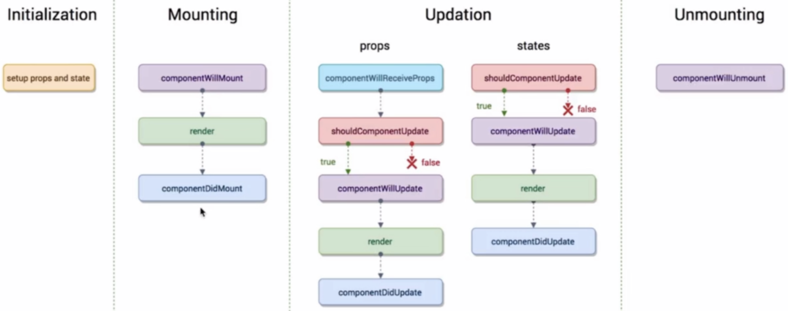

生命周期函数指在某一个时刻组件会自动调用执行的函数

* Initialization
  * setup props and state
* Mounting
  * componentWillMount 组件即将被挂载到页面的时刻调用
  * render
  * componentDidMount 组件被挂载到页面后调用
* Updation
  * props
    * componentWillReceiveProps 一个组件从父组件接收了参数，只要父组件的render函数被重新执行了，子组件的这个生命周期函数就会被执行
    * shouldComponentUpdate 组件被更新之前调用，该方法需要返回true/false，用以告知React是否继续下面的工作
    * componentWillUpdate
    * render
    * componentDidUpdate
  * states
    * shouldComponentUpdate
    * componentWillUpdate
    * render
    * componentDidUpdate
* Unmounting
  * componentWillUnmount


# 生命周期函数的使用场景
**componentWillMount**

**render**

**componentDidMount**

发送ajax请求放在这个生命周期函数里是最合适不过的。

```js
import axios from 'axios'
componentDidMount () {
  axios.get('/api/todolist').then(response => {
    this.setState(() => ({
      list: [...response.data]
    }))
  })
}
```


**componentWillReceiveProps**

**shouldComponentUpdate**

在之前的TodoList组件中，我们在输入框中输入内容， 父组件的render函数被重新执行，TodoItem组件中的render函数也会被重新执行，但是此时我们还没有点击提交按钮，TodoItem此时根部不需要重新渲染才对，所以我们需要在这个生命周期函数中做一个判断，只有当下一个props里的content和当前的content不相等的时候，我们才让组件重新渲染

```js
/**
 * 该方法接收两个参数
 * nextProps 下一个props
 * nextState 下一个state
*/ 
shouldComponentUpdate (nextProps, nextState) {
  // 我们在这里做判断，如果下一个content和当前的content不相同时才允许组件重新渲染
  return nextProps.content !== this.props.content
}
```


**componentWillUpdate**

**componentDidUpdate**


**componentWillUnmount**

