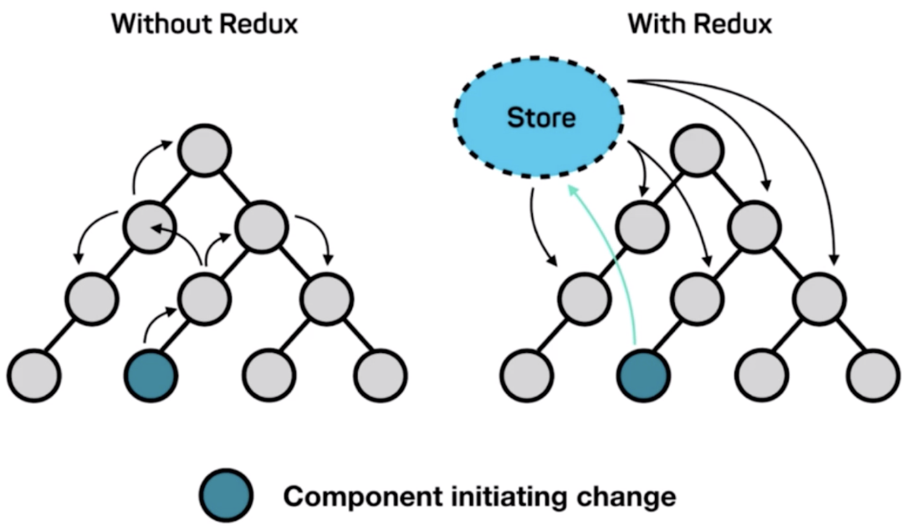

React 官方的定义是一个javascript视图层框架

如果单纯的使用它开发大型的项目几乎是不可能的，因为数据的管理和传递会非常的麻烦，父子组件之间通信还好，但是遇到不是父子组件关系的那些组件之间交互就会无从下手

所以如果我们想要开发大型应用，那就需要在React的基础上配套使用一个数据层的框架，与其结合使用

> * Redux = Reducer + Flux
> * 2013年facebook推出react之后，同时也推出了flux这个最原始的数据层框架
> * 但是flux推出之后，业界的人去使用的时候发现：它存在一些缺陷（目前也已经过时）
> * 于是有人就把flux做了一次升级，更名为redux
> * 在Redux中，除了借鉴flux之外，还引入了一个Reducer的概念

# Redux工作流
